# Quiz
 This Quiz project is done by using Node.js and MongoDB./s/s
 Download and navigate to this project, type `npm run devStart` to start the server.
 
 ## Flowchart
 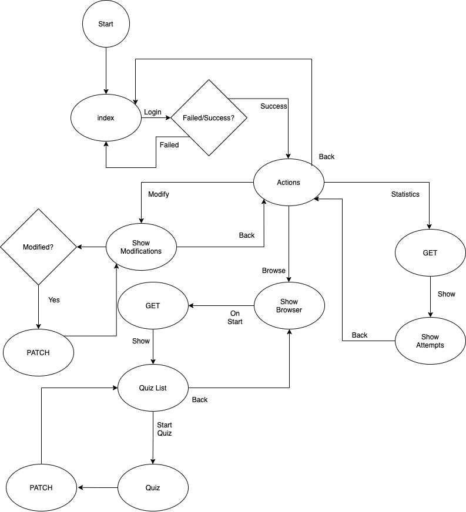
 
 ## Database Structure
 ```
 {
   name

   quiz:[{

      name

      questions:[{

         question
         answer

      }]
   }]

   attempted:[{

      quizName
      completion
      Score

   }]

}
 ```
 
 ## Login Page(index.html)
 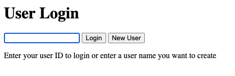
 
 ### When the Login button is pressed with a faulty ID
 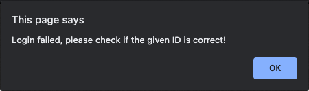
 
 ### When the New User button is pressed with a blank user name
 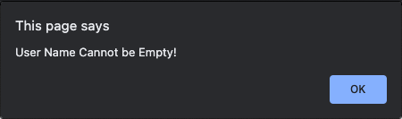
 
 ### New User is Created
 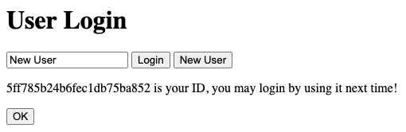
 
 ### After the OK button is clicked(when new user created) or Login successfully
 ### The Actions page shows up
 
 ## Action Page(action.html)
 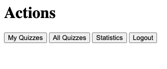
 
 ## Quiz Browser(browseQuizzes.html)
 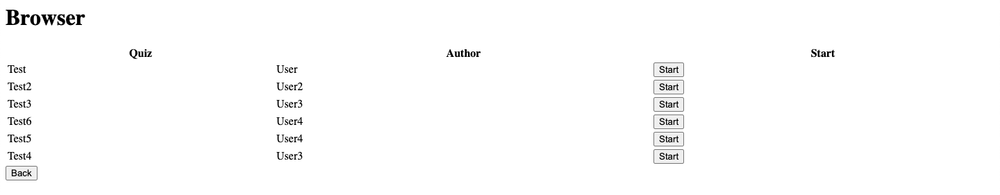
 
 ### When a Start button is pressed
 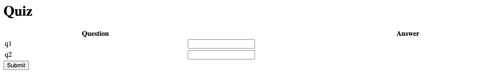
 
 ### After the Submit button is pressed, the score shows up
 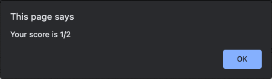
 
 ### Then the Back button will be available
 
 
 ## My Quizzes(myQuiz.html)
 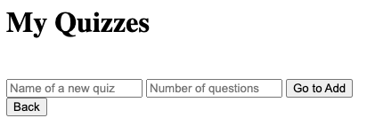
 
 ### When user tries to add a quiz without name
 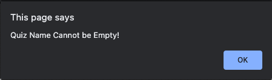
 
 ### When user tries to add a quiz without number of questions
 
 
 ### Example Quiz
 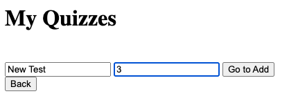
 
 ### When the Go to Add button is clicked
 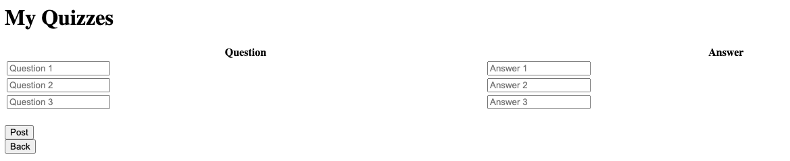
 
 ### When empty questions or answers were given
 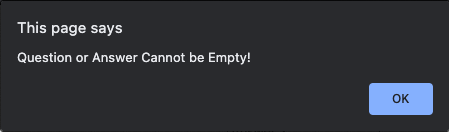
 
 ### Example Question Set
 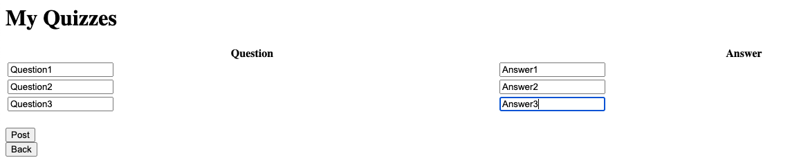
 
 ### After the quiz is posted
 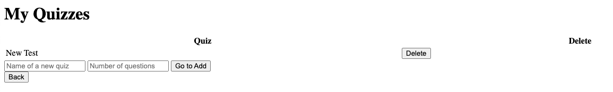
 
 ### Back to Quiz Browser to check
 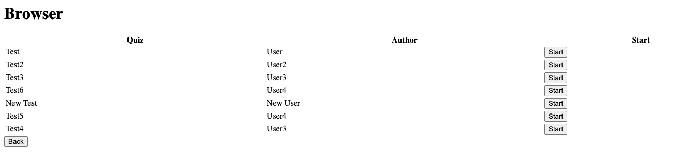
 
 ## Statistics(statistics.html)
 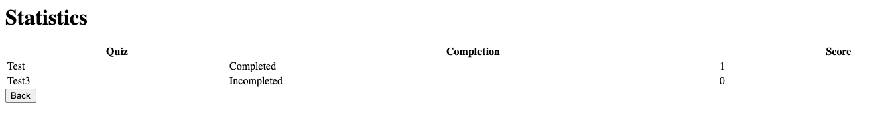


 


 


 
 

 

 
 

 

 


